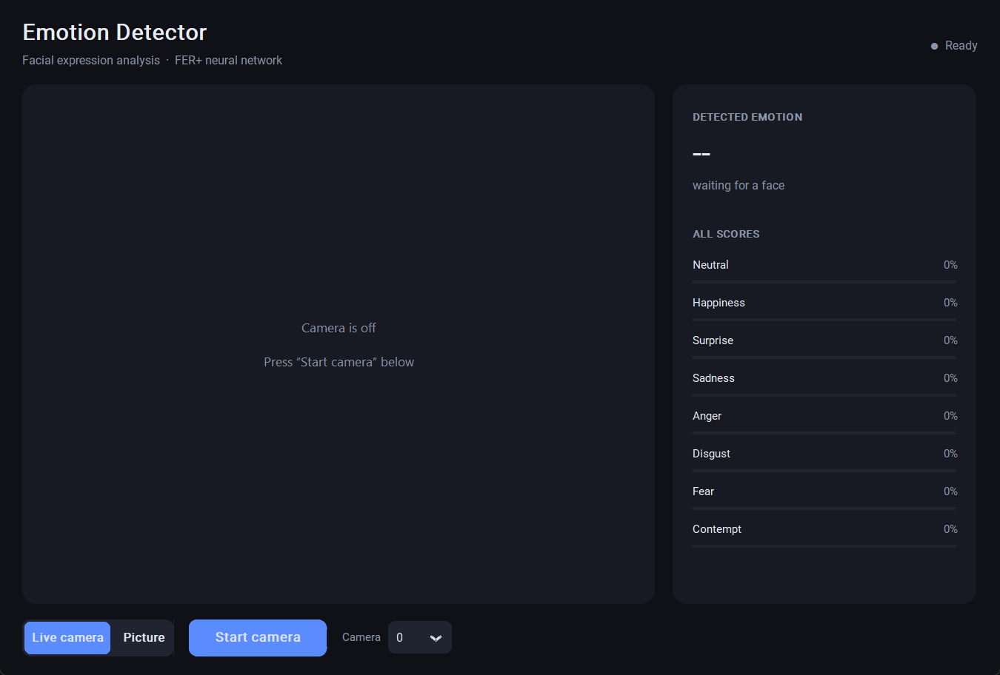

# Emotion Detector

A desktop app that reads facial expressions and tells you which emotion a face
is showing, with a confidence score for all eight emotions it knows.

It works two ways:

- **Live camera** — watches your webcam continuously and updates as you move.
- **Picture** — you pick an image file. Every face in it is found and numbered,
  and you choose which one to analyse, from the dropdown or by clicking it.

It runs entirely on your own machine. No internet connection is needed after the
one-time model download, and no image ever leaves your laptop.



<sub>Shown before the camera starts. Swap in your own by overwriting
`docs/screenshot.png`.</sub>

---

## 1. What you need

- **Python 3.9 or newer** (you have 3.13, which is fine)
- **A webcam**
- **VS Code** with the official **Python extension** by Microsoft

To check Python is installed, open a terminal and run:

```bash
python --version
```

---

## 2. Setup in VS Code, step by step

### Step 1 — Open the folder

In VS Code: **File → Open Folder…** and choose the `emotion_detector` folder.

Opening the *folder* (not just a file) matters — it is what lets VS Code find
the other files in the project and run things from the right place.

### Step 2 — Open the terminal

Press **Ctrl + `** (the backtick key, above Tab). A terminal opens at the bottom,
already pointed at your project folder.

### Step 3 — Create a virtual environment (recommended)

A *virtual environment* is a private box of libraries just for this project, so
installing something here can never break another project.

```bash
python -m venv .venv
```

Then activate it. On Windows PowerShell:

```bash
.venv\Scripts\Activate.ps1
```

You will see `(.venv)` appear at the start of the terminal line. That is how you
know it worked.

> If PowerShell blocks the script with a "running scripts is disabled" error,
> run this once, then try activating again:
> `Set-ExecutionPolicy -Scope CurrentUser RemoteSigned`

### Step 4 — Tell VS Code to use that environment

Press **Ctrl + Shift + P**, type `Python: Select Interpreter`, and choose the one
with `.venv` in its path. This is the step people most often skip, and it is why
code sometimes runs in the terminal but shows red squiggles in the editor.

### Step 5 — Install the libraries

```bash
pip install -r requirements.txt
```

### Step 6 — Download the emotion model (once)

```bash
python download_model.py
```

This pulls a 33 MB file into a new `models/` folder. It is the trained neural
network itself — too big to ship inside the code, which is why it is a separate
step.

### Step 7 — Run it

```bash
python app.py
```

Or just press **F5** — this project ships a `.vscode/launch.json`, so F5 runs the
app with VS Code's debugger attached (you can set breakpoints by clicking to the
left of a line number).

Click **Start camera**, and allow camera access if Windows asks.

---

## 3. The files, and what each one does

| File | What it is for |
| --- | --- |
| `app.py` | The window: buttons, the video panel, the score bars. Run this one. |
| `emotion_detector.py` | The actual computer vision. Takes an image, returns emotions. No GUI code at all. |
| `download_model.py` | Fetches the trained model. Run once. |
| `requirements.txt` | The list of libraries to install. |
| `.vscode/launch.json` | Makes F5 work in VS Code. |
| `models/` | Where the downloaded model lives. Created by step 6. |

The split between `app.py` and `emotion_detector.py` is deliberate and worth
copying in your own projects: **the logic does not know the interface exists.**
Because of that, you can test the detector without opening a window at all:

```bash
python emotion_detector.py
```

That opens a bare OpenCV preview window. Press **Q** to close it. If this works
but the main app does not, you know the problem is in the GUI, not the vision.

---

## 4. How it actually works

Every single frame from your camera goes through five steps:

1. **Grayscale.** Colour tells you nothing about an expression, and dropping it
   makes everything that follows about three times faster.

2. **Find the face.** This uses a *Haar cascade* — a fast, old-school detector
   that slides a window over the image looking for the light-and-dark patterns a
   face makes (eye sockets are darker than cheeks, and so on). It ships inside
   OpenCV, so there is nothing to download. To keep it quick, the search runs on
   a half-size copy of the image and the resulting box is scaled back up.

3. **Crop and shrink to 64×64.** The neural network was trained on tiny 64×64
   grayscale face crops, so the input has to match that exactly.

4. **Run the network.** The model is **FER+**, trained by Microsoft Research on
   the FER2013 dataset, where each face was labelled by 10 different people. It
   outputs eight raw scores. `softmax()` turns those into percentages that add
   up to 100%.

5. **Smooth over time.** A single frame's answer jitters — happiness one frame,
   neutral the next. The app averages the last 6 frames, which is what makes the
   readout feel steady instead of twitchy. That is the `smoothing` setting in
   `EmotionDetector.__init__`.

### How several faces are handled

The two modes deliberately behave differently, because they are answering
different questions.

**Live camera** has to pick someone without being able to ask. Every face gets
a box drawn on it, but only the *largest* one — the person nearest the camera —
is coloured, drives the side panel, and gets smoothed. Everyone else is outlined
in grey. The panel notes "· 3 faces" so you know others were seen. Up to 4 faces
are classified per frame; each one costs about 10 ms, and beyond that the frame
rate suffers for little benefit.

**Picture mode** makes no such guess. It finds up to 12 faces, numbers them
`1`, `2`, `3`… and waits for you to choose. The selected face is drawn in its
emotion colour with a full label; the rest stay grey with just their number.
You can switch with the dropdown or by clicking a face directly — the two stay
in sync.

Still images also use different detection settings from video, for reasons that
are worth understanding:

| | Live camera | Picture |
| --- | --- | --- |
| Smoothing | on — averages 6 frames | **off** |
| Max faces | 4 | 12 |
| Minimum face size | 80 px | 56 px |

Smoothing is the important one. Averaging the last few frames is what stops the
live readout flickering, but a photograph is a single fixed moment — there are
no "recent frames" to average with, and leaving it on would blend the photo with
whatever the webcam saw earlier. So `detect()` takes a `smooth` argument, and
picture mode passes `False`.

### The threading bit

The camera work takes roughly 25–35 milliseconds per frame. If that ran inside
the GUI, the window would lock up solid between frames — no clicking, no
dragging, and Windows would eventually grey it out as "not responding".

So there are two threads. `CameraThread` grabs and analyses frames in the
background, dropping each result into a shared variable. The GUI checks that
variable about 30 times a second and paints whatever it finds. A
`threading.Lock` makes sure they are never touching it at the same instant.

This is the standard shape of every responsive desktop app: **slow work on a
background thread, the interface thread stays free.**

---

## 5. Things to try changing

Small edits that teach you a lot:

- **`smoothing=6`** in `emotion_detector.py`. Set it to `1` to see the raw,
  jittery per-frame output, or `20` for a very slow, heavily-averaged reading.
- **`minNeighbors=6`** in `detect()`. Lower it to `3` and the detector finds more
  faces but also starts seeing faces in doorknobs and patterned shirts.
- **`RAMP_LIGHT` and `RAMP_DARK`** at the top of `emotion_detector.py`. Every
  emotion's colour is a blend between these two, spread evenly down the list, so
  changing just those two values re-themes the whole panel. Try `#ffe6c7` and
  `#c2410c` for a warm palette. The boxes drawn on faces use `OVERLAY_COLORS`
  instead — a separate, vivid colour per emotion, so the box visibly changes the
  moment your expression does. It is kept separate from the ramp on purpose: a
  photo can be any colour, and pale tints both vanish against a light background
  and leave the white label text on them unreadable.
- **`DETECT_SCALE = 0.5`**. Set it to `1.0` for slightly more precise boxes at
  roughly 25% more CPU cost.
- Add a **screenshot button** that saves the current frame with `cv2.imwrite`.

---

## 6. If something goes wrong

**"module 'cv2' has no attribute 'CascadeClassifier'"**
You have OpenCV 5 installed. Version 5 removed the Haar cascade face detector
this app uses, so it must stay on the 4.x line:

```bash
pip install "opencv-python>=4.8,<5"
```

`requirements.txt` already pins this, so it only bites if you installed OpenCV
by hand. The app now checks the version at startup and says so directly.

**"Emotion model not found"**
You skipped step 6. Run `python download_model.py`.

**"Could not open camera 0"**
Something else is holding the camera — Zoom, Teams, Discord, or the Windows
Camera app. Close it and press Start again. Also check
**Settings → Privacy & security → Camera** and make sure *Let desktop apps
access your camera* is on. If you have more than one camera, try index `1` or
`2` in the dropdown next to the button.

**The video is very dark, or no face is ever detected**
Face detection needs light on your face. Check the physical privacy shutter on
your webcam, and try facing a window or lamp. A dark webcam also drops to a very
low frame rate, which makes the app feel sluggish — that is the camera, not the
code.

**"No faces found" on a picture that clearly has faces**
The detector wants reasonably front-facing faces. Profiles, tilted heads, heavy
shadow, sunglasses, and very small faces in a big group shot all get missed. Two
knobs help, both in `_analyse_picture` in `app.py`: lower `min_face` from `56`
to catch smaller faces, and lower `minNeighbors` in `detect()` from `6` to `4`.
Both make the detector less fussy, and both bring more false positives — you may
start seeing "faces" in patterned backgrounds.

**It says "no face detected" even though you are on screen**
Haar cascades want a reasonably straight-on face. Turning your head far to one
side, heavy backlighting, or sitting very far back will lose it. Sit closer;
your face needs to be at least 80 pixels wide.

**Low FPS**
Expect roughly 15–25 FPS on a typical laptop CPU. Lowering `VIDEO_W, VIDEO_H` in
`app.py` to `480, 360` will speed it up.

---

## 7. Honest limits of this thing

Worth knowing before you take any reading seriously:

- It classifies **facial expressions, not feelings.** A polite smile and genuine
  happiness look identical to it. People also routinely feel one thing and show
  another.
- FER2013, the training data, is small, mostly Western, and was labelled by
  people guessing from photos. Accuracy is uneven across faces, skin tones,
  glasses, and lighting.
- "Contempt" and "disgust" are the weakest classes by a wide margin — they were
  rare in the training data.
- Treat it as a fun demo and a way to learn the pipeline, which is exactly what
  the versions you have seen on Instagram are.

---

## 8. Credits

- **FER+ model** — Barsoum et al., *Training Deep Networks for Facial Expression
  Recognition with Crowd-Sourced Label Distribution* (Microsoft Research),
  distributed via the [ONNX Model Zoo](https://github.com/onnx/models) under the
  MIT licence.
- **Face detection** — Viola–Jones Haar cascade, bundled with OpenCV.
